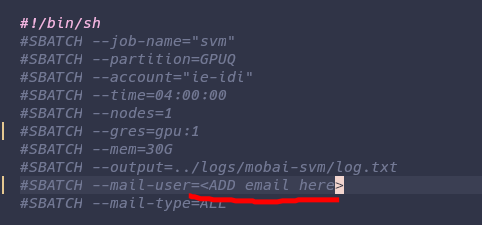

# How to train with the mobai svm
Step 1: 

run merge_feature_dataset.py 


Example usage:
```bash
python merge_feature_dataset.py \
  --original datasets/unibo/runnable/Feature_Morphed \
  --new datasets/mordiff/full_morphed_features/Feature_Morphed \
  --output datasets/mordiff/runnable

```

Step 2:
copy the data_full folder from the unibo dataset into the new dataset 
or create empty files with the same name

Step 3: 

Remove all the .DS_store files

Step 4: 

If on IDUN run the slurm script, remember to add email in the email field.



If not use the bash script svm_train.sh

